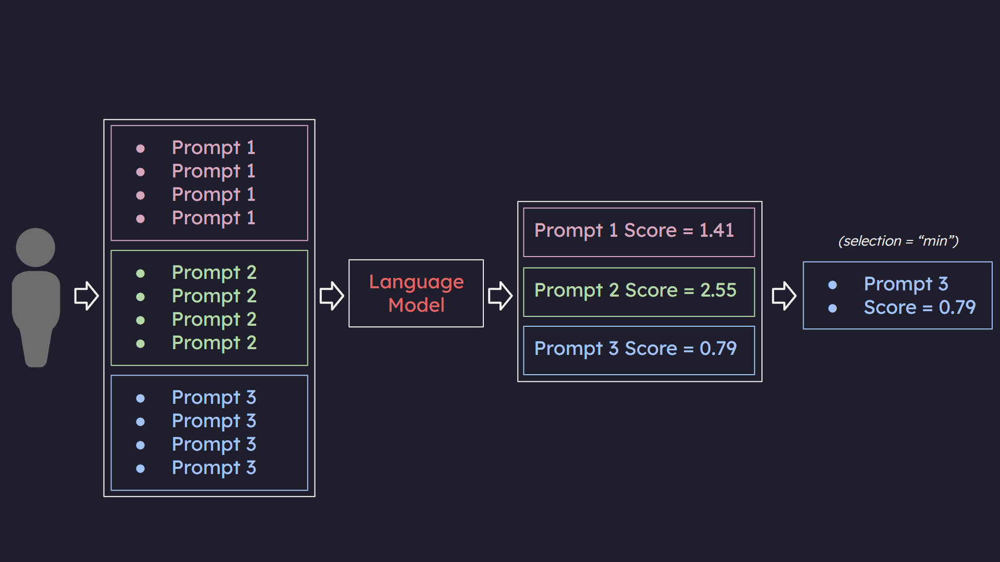

# LangDiversity Hello World 📝

Welcome! In this document, we outline how LangDiversity functions along with a simple program that demonstrates its capabilities.

The image below is a visual representation of how LangDiversity works.



1. In the example above, we have a user prepare in 3 prompts. For each prompt, they are trying to obtain 4 separate responses from the language model.
2. Using those 4 responses, LangDiversity performs a calculation based on the measure chosen (Entropy, Gini Impurity, etc.). This gives us a numerical value representing the diversity of the language model's responses to each prompt.
3. Each prompt is now associated with its corresponding diversity measure.
4. Then based on the user's selection method, the prompt with the desired diversity measure and its associated value are returned.

## Code Implementation

### Installation

Before you start using LangDiversity, you'll need to install it. You can do so with pip:

```bash
pip install langdiversity
```

### Importing Diversity Measure

Import the diversity measure you want to use. In this example, we're using [Shannon's entropy](https://github.com/lab-v2/langdiversity/blob/main/langdiversity/measures/shannon_entropy.py).

```python
from langdiversity.measures import ShannonEntropyMeasure
diversity_measure = ShannonEntropyMeasure()
```

### Configuring the Language Model

In this step, we configure our language model. For this example, we're utilizing [OpenAI's GPT model](https://github.com/lab-v2/langdiversity/blob/main/langdiversity/models/openai.py). Additionally, we import a parser to sanitize and format the responses generated by the language model.

Note: It's recommended to use a custom parser tailored to the specific type of questions you'll be working with. LangDiversity offers a variety of [built-in parsers](https://github.com/lab-v2/diversity_package/tree/main/langdiversity/parser/answer_extractor.py) that you can use as a reference or starting point.

Since our example will involve math-related questions, we opt for the `extract_math_answer` parser to handle the responses.

```python
from langdiversity.models import OpenAIModel
from langdiversity.parser import extract_math_answer
model = OpenAIModel(openai_api_key="[API KEY]", extractor=extract_math_answer)
```

### Collecting Diversity Measures

In this step, we initialize the `DiversityMeasureCollector` object. This is where we specify how many responses we want from the language model for each prompt and the diversity measure to use.

```python
from langdiversity.utils import DiversityMeasureCollector
diversity_collector = DiversityMeasureCollector(model=model, num_responses=4, diversity_measure=diversity_measure)
```

### Collecting Data

Next, we pass in a list of prompts to the `DiversityMeasureCollector` object. It will send these prompts to the language model, collect the responses, and calculate the diversity measure for each set of responses.

Note: The prompts are structured to guide the language model in generating a specific type of response. This makes it easier for the parser to extract clean answers.

```python
prompts = [
            "At the end, say 'the answer is [put your numbers here separated by commas]'.\nQuestion: What is the speed of the current if Junior's boat can cover 12 miles downstream in the same time it takes to travel 9 miles upstream, given that his boat's speed in still water is 15 miles per hour?",
            "At the end, say 'the answer is [put your numbers here separated by commas]'.\nQuestion: What is the speed of the current if Junior's boat travels at a constant speed of 15 miles per hour in still water and he spends the same amount of time traveling 12 miles downstream as he does traveling 9 miles upstream?.",
            "At the end, say 'the answer is [put your numbers here separated by commas]'.\nQuestion: Juniors boat will go 15 miles per hour in still water . If he can go 12 miles downstream in the same amount of time as it takes to go 9 miles upstream , then what is the speed of the current?",

]

diversity_collector.collect(prompts, verbose=True)  # Set verbose to True to see intermediate values
```

### Prompt Selection

Now, we initialize the `PromptSelection` object with the data collected in the previous step.

```python
from langdiversity.utils import PromptSelection
prompt_selection = PromptSelection(data=diversity_collector.data, selection="min")
```

### Selecting Prompts

Finally, we call the `select` method on the `PromptSelection` object to filter out the prompts based on the user's specified diversity measure.

In this example, the data containing selected prompts and their corresponding diversity measure is stored in `selected_data`. We then print out the diversity score and each selected prompt.

```python
selected_data = prompt_selection.select()

print(f"Diversity Score: {selected_data['diversity']}")
print("Selected Prompts:")
for prompt in selected_data['selected_prompts']:
    print(prompt)
```
